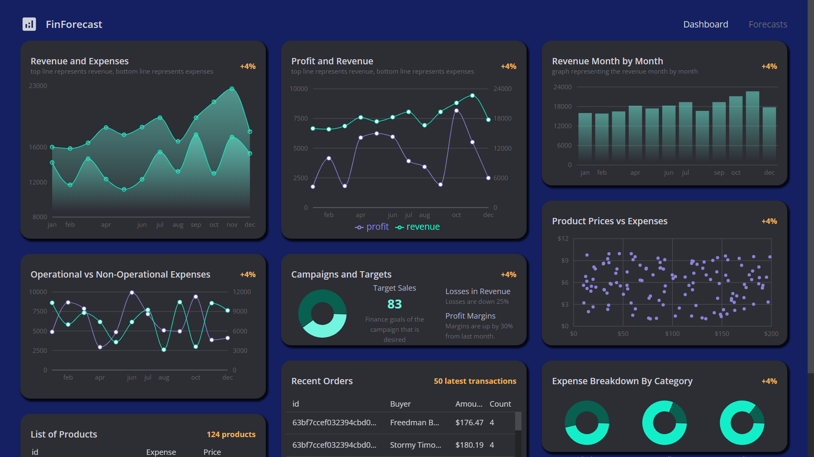

# :zap: MERN Full Stack Tracker

* Mongo Express React Node (MERN) full-stack app, integrates React frontend with Node.js backend
* Code from [@EdRohDev](https://www.youtube.com/@EdRohDev) with code changes and commenting added
* **Note:** to open web links in a new window use: _ctrl+click on link_


## :page_facing_up: Table of contents

* [:zap: MERN Full Stack Tracker](#zap-mern-full-stack-tracker)
  * [:page\_facing\_up: Table of contents](#page_facing_up-table-of-contents)
  * [:books: General info](#books-general-info)
    * [:books: Backend](#books-backend)
    * [:books: Frontend](#books-frontend)
  * [:camera: Screenshots](#camera-screenshots)
  * [:signal\_strength: Backend Technologies](#signal_strength-backend-technologies)
  * [:signal\_strength: Frontend Technologies](#signal_strength-frontend-technologies)
  * [:floppy\_disk: Setup - Backend](#floppy_disk-setup---backend)
    * [:floppy\_disk: Setup - Frontend](#floppy_disk-setup---frontend)
  * [:computer: Code Examples](#computer-code-examples)
  * [:cool: Features](#cool-features)
  * [:clipboard: Status \& To-Do List](#clipboard-status--to-do-list)
  * [:clap: Inspiration](#clap-inspiration)
  * [:file\_folder: License](#file_folder-license)
  * [:envelope: Contact](#envelope-contact)

## :books: General info

### :books: Backend

* MongoDB Atlas used as the backend database - requires mongodb to be running
* [Mongoose query models](https://mongoosejs.com/docs/queries.html) used to interact with the database
* Note: I used 'my ip address' as the whitelist network access in MongoDB.Atlas but this required daily updating when my ip address changed - otherwise with a non-matching ip address the backend simply did not work. Better to use the localhost address to avoid this problem but may be less secure.
* Node.js routes used with controller functions
* 

### :books: Frontend

* [React reducers](https://reactjs.org/docs/hooks-reference.html) functions that take the current state and an action as arguments, and return a new state result. In other words, (state, action) => newState.

## :camera: Screenshots




## :signal_strength: Backend Technologies

* [MongoDB Community Server v4](https://www.mongodb.com/download-center/community) Document database so it uses Object Document Mapper (ODM) to translate between objects in code and the document representation of the data.
* [MongoDB Compass v1](https://www.mongodb.com/es/products/compass) to explore and manipulate MongoDB data
* [Mongoose v7](https://www.npmjs.com/package/mongoose) async object modeling tool
* [Express.js middleware v4](https://expressjs.com/)
* [Node.js v18](https://nodejs.org/es/)

## :signal_strength: Frontend Technologies

* [Vite v4](https://vitejs.dev/) Frontend Tooling
* [React framework v17](https://reactjs.org/)
* [@mui Material UI v5](https://mui.com/material-ui/getting-started/overview/) react UI components
* [@mui Data Grid v6](https://mui.com/x/api/data-grid/data-grid/) react data table and react data grid
* [@mui styled()](https://mui.com/system/styled/) components
* [@mui Material Icons](https://mui.com/material-ui/material-icons/)
* [Recharts v2](https://recharts.org/en-US/) bar, line, pie and scatter charts used
* [regression v2](https://www.npmjs.com/package/regression) JavaScript module containing a collection of linear least-squares fitting methods for simple data analysis.

## :floppy_disk: Setup - Backend

* Install backend dependencies using `npm i`
* Install [nodemon](https://www.npmjs.com/package/nodemon) globally if you don't already have it
* Register with [MongoDB Atlas](www.mongodb.com), create & configure a database cluster and add connection string to `.env` file (see `.env.example` file)
* Run `npm run dev` for a dev server
* Backend data can be viewed using Thunder Client using urls for example: `localhost:1337/kpi/kpis`

### :floppy_disk: Setup - Frontend

* Change to `/client` directory run `npm run dev`. Frontend will open at `http://localhost:5173/`

## :computer: Code Examples

* Use React hook useMemo to cache results of data mapping

```typescript
  const revenue = useMemo(() => {
    const revenueData =
      data &&
      data[0].monthlyData.map(({ month, revenue }) => {
        return {
          name: month.substring(0, 3),
          revenue: revenue,
        };
      });
    console.log("revenueData", revenueData);
    return revenueData;
  }, [data]);
```

## :cool: Features

* graph data stored in cache and derived from database data using map functions

## :clipboard: Status & To-Do List

* Status: Working
* To-Do: add commenting

## :clap: Inspiration

* [EdRohBuild A MERN Finance Dashboard App | Machine Learning, Typescript, React, Node, MUI, Deployment](https://www.youtube.com/watch?v=uoJ0Tv-BFcQ&t=16s)
* [React documentation](https://reactjs.org/docs/getting-started.html)
* [Medium article: Why MERN?](https://medium.com/geekculture/why-mern-a125cca5ab0e)
* [CSS Tricks: A Complete Guide to Flexbox](https://css-tricks.com/snippets/css/a-guide-to-flexbox/)

## :file_folder: License

* N/A.

## :envelope: Contact

* Repo created by [ABateman](https://github.com/AndrewJBateman), email: gomezbateman@yahoo.com
